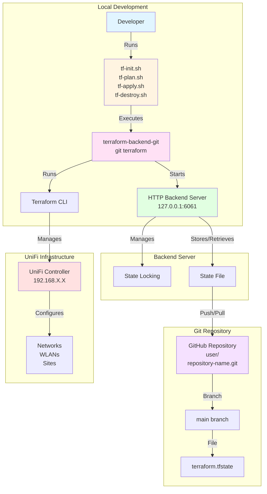
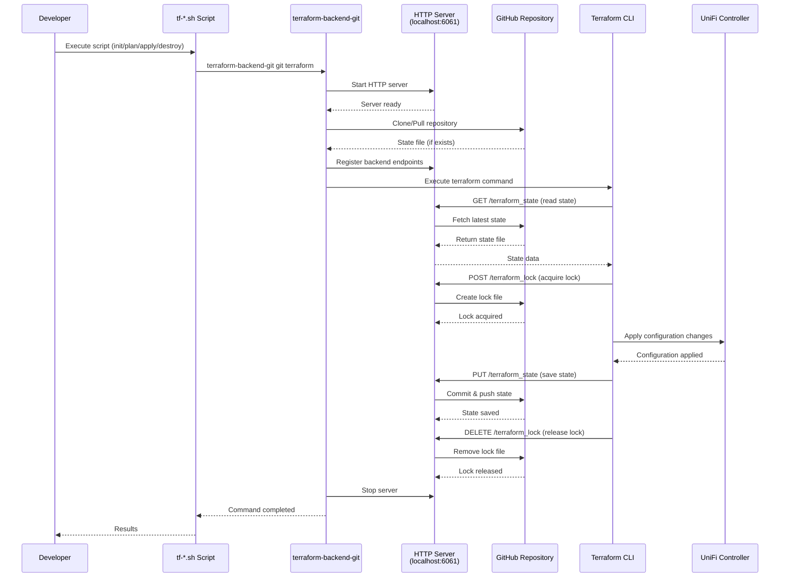
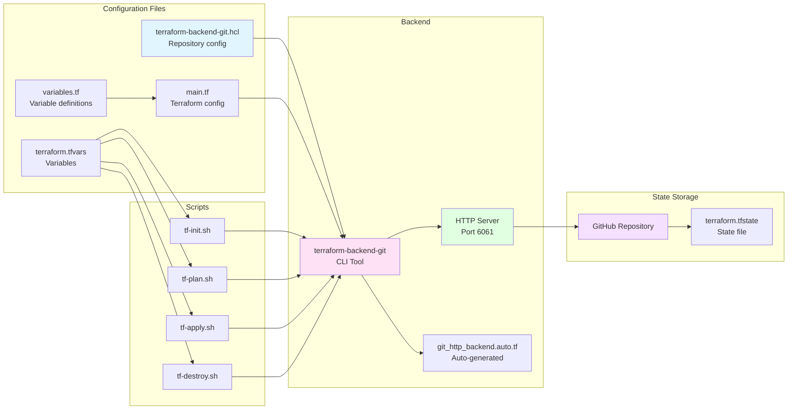
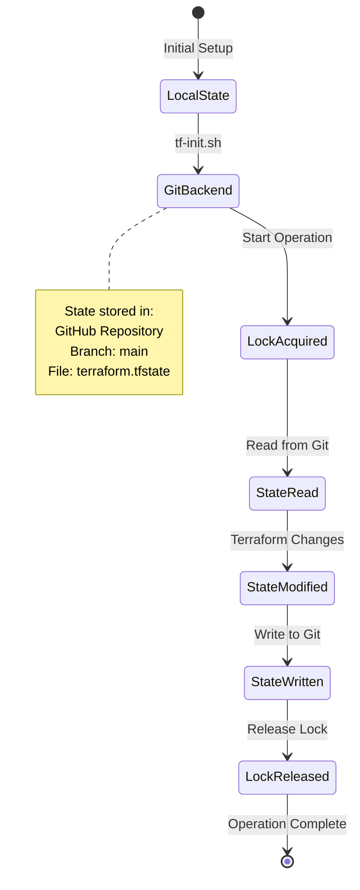
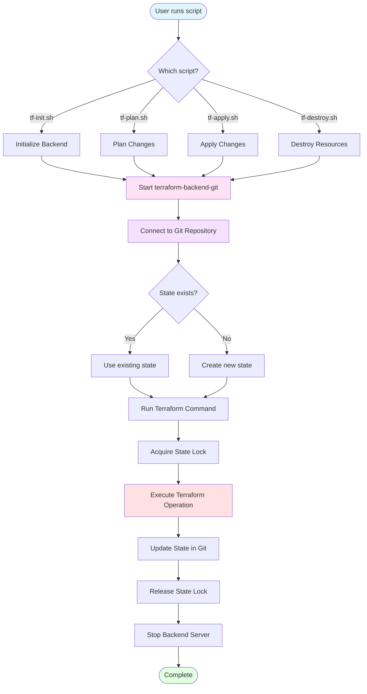
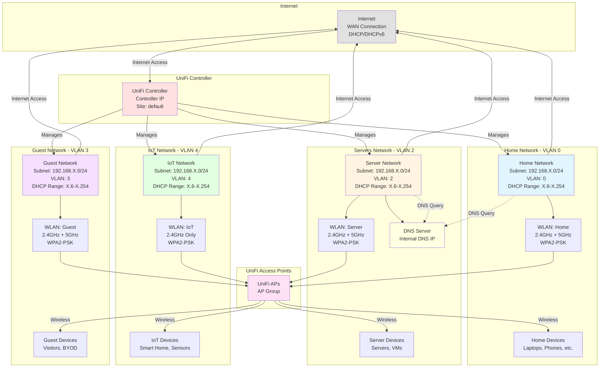
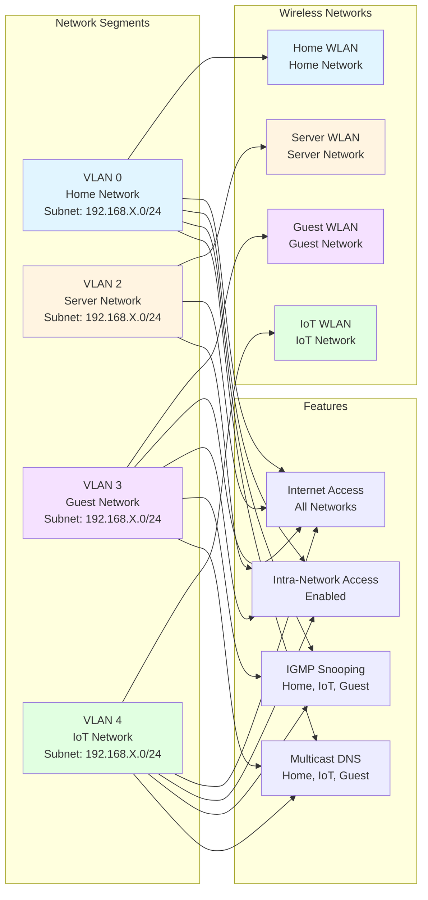
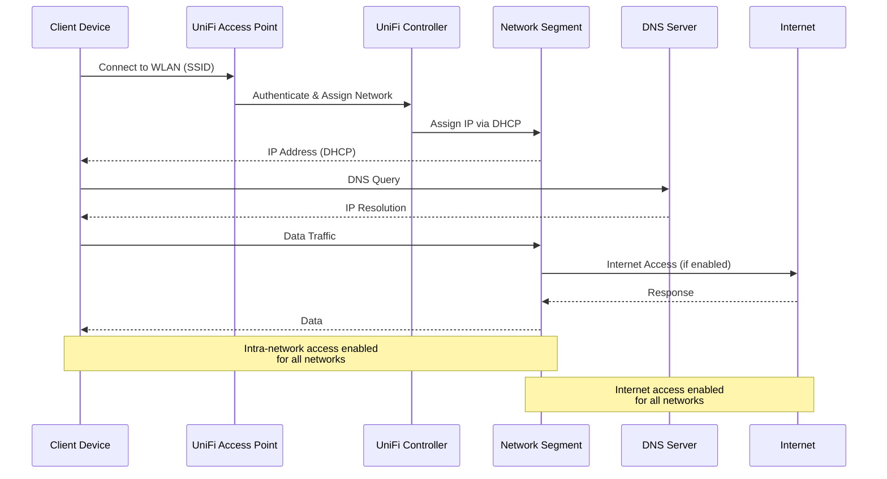

# Terraform Backend Git Architecture

## System Architecture

## Workflow Diagram

## Component Relationships

## State Management Flow

## Script Execution Flow

## Network Topology

### Infrastructure Network Diagram

### Network Segmentation Diagram

### Data Flow Diagram

